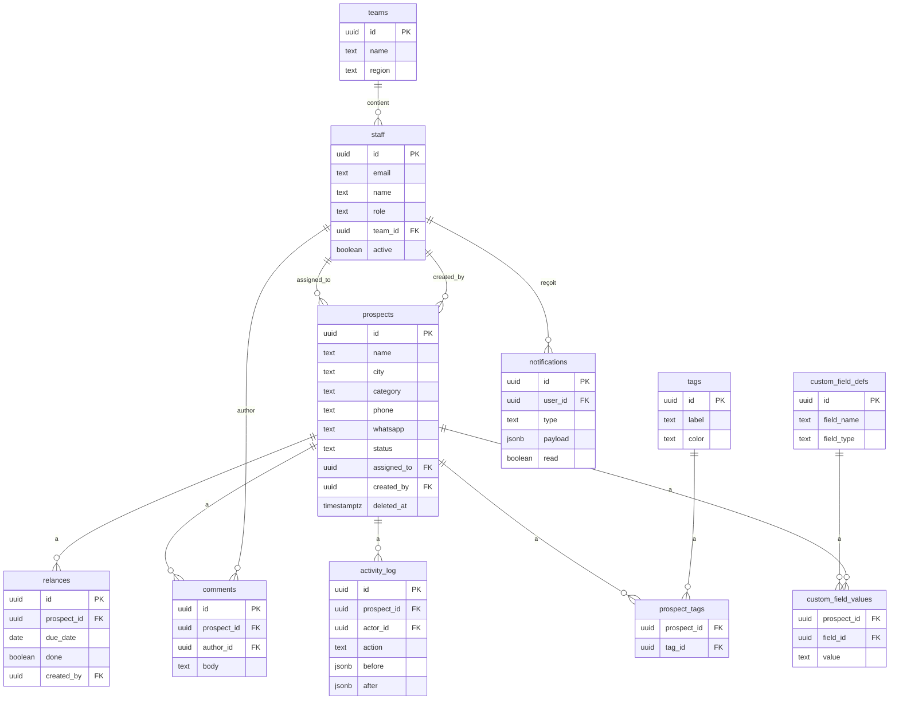

# Doko Prospection — Vision long terme & Roadmap production

## Contexte

L'équipe actuelle (2-3 personnes) va **s'agrandir progressivement**. Le projet est déployé sur un **VPS Hetzner** (4 vCPU / 8 GiB RAM / 80 GiB SSD) via **Coolify**, avec **Supabase self-hosted** comme backend.

---

## État des lieux — Ce qui existe déjà (v0.1)

| Fonctionnalité | État |
|---|---|
| Auth email/mot de passe (Supabase Auth) | ✅ Complet |
| Table `staff` avec allowlist (`active = true`) | ✅ Complet |
| CRUD Prospects (créer, lire, modifier, soft-delete) | ✅ Complet |
| Pipeline 5 statuts (`a_contacter` → `contacte` → `interesse` → `client` → `refuse`) | ✅ Complet |
| Historique d'activité (`activity_log`) automatique | ⚠️ Partiel — manque le log sur `updateProspect` |
| Relances (créer, lister échues, marquer "fait") | ⚠️ Partiel — pas de liste sur fiche prospect, pas de vue futures/passées |
| Recherche par nom/téléphone + filtres (statut, ville) | ✅ Complet |
| Export CSV filtré | ✅ Complet |
| RLS Postgres sur les 4 tables | ✅ Complet |
| Pagination serveur | ⚠️ Backend OK, mais **pas de boutons Précédent/Suivant** dans l'UI |
| Tests unitaires (CSV, staff gate, prospects filter) | ✅ Complet |
| Test RLS automatisé | ✅ Complet |
| Déploiement Cloudflare Workers | ✅ Complet |

> [!NOTE]
> La base est **solide pour un MVP**. Le code est propre, bien structuré (Server Actions, RLS, validation Zod). Mais il manque tout ce qui est nécessaire pour une **équipe qui grandit** et un **usage quotidien intensif**.

---

## ⚫ Phase 0 — Corrections immédiates (bugs et manques découverts par l'audit)

> [!CAUTION]
> Ces 6 points sont des **bugs ou fonctionnalités incomplètes** dans le code actuel. Ils doivent être corrigés **avant toute mise en production**, indépendamment de la roadmap.

#### 0.1 🐛 Boutons de pagination manquants

**Fichier** : [`src/app/(dashboard)/prospects/page.tsx`](file:///e:/Projet%20Bot_cameroun/doko-prospection/src/app/(dashboard)/prospects/page.tsx)

Le backend calcule correctement `page`, `pageSize`, `total` et `totalPages`, mais l'UI n'affiche qu'un texte `Page 1 sur 2 — 35 prospects` **sans aucun bouton pour naviguer**. Au-delà de 25 prospects, l'utilisateur est bloqué.

**Correction** : Ajouter des liens `Précédent` / `Suivant` qui modifient le `searchParam` `page`.

#### 0.2 🐛 Pas d'audit log sur la modification d'un prospect

**Fichier** : [`src/server/prospects-actions.ts`](file:///e:/Projet%20Bot_cameroun/doko-prospection/src/server/prospects-actions.ts) — fonction `updateProspect`

La création, le changement de statut et le soft-delete passent par des RPC qui écrivent dans `activity_log`. Mais `updateProspect` fait un simple `.update()` sans traçabilité. Si un commercial modifie le téléphone ou l'adresse d'un prospect, **personne ne le sait**.

**Correction** : Créer une RPC `update_prospect_with_log` qui capture le diff avant/après, ou ajouter un trigger Postgres.

#### 0.3 🐛 Pas de liste des relances sur la fiche prospect

**Fichier** : [`src/app/(dashboard)/prospects/[id]/page.tsx`](file:///e:/Projet%20Bot_cameroun/doko-prospection/src/app/(dashboard)/prospects/%5Bid%5D/page.tsx)

Le formulaire d'ajout de relance est présent, mais **aucune liste des relances existantes** (passées ou à venir) n'est affichée pour ce prospect. L'utilisateur crée des relances à l'aveugle.

**Correction** : Ajouter un `listRelancesForProspect(prospectId)` et afficher la liste sous le formulaire.

#### 0.4 🐛 Pas de vue relances futures / historique

**Fichier** : [`src/app/(dashboard)/relances/page.tsx`](file:///e:/Projet%20Bot_cameroun/doko-prospection/src/app/(dashboard)/relances/page.tsx)

La page `/relances` n'affiche que `due_date <= today AND done = false`. Il n'y a aucun moyen de voir :
- Les relances **planifiées pour les jours suivants**
- Les relances **déjà traitées** (historique)

**Correction** : Ajouter des onglets ou filtres "En retard", "Aujourd'hui", "À venir", "Traitées".

#### 0.5 🐛 Texte erroné sur la page access-denied

**Fichier** : [`src/app/access-denied/page.tsx`](file:///e:/Projet%20Bot_cameroun/doko-prospection/src/app/access-denied/page.tsx)

Le texte mentionne *"Ce compte Google n'est pas autorisé..."* alors que l'authentification est en réalité par email/mot de passe (vestige du blueprint qui prévoyait Google OAuth).

**Correction** : Remplacer par *"Ce compte n'est pas autorisé à accéder à l'application."*

#### 0.6 🐛 Formulaire de relance non réinitialisé après soumission

**Fichier** : [`src/components/relances/relance-form.tsx`](file:///e:/Projet%20Bot_cameroun/doko-prospection/src/components/relances/relance-form.tsx)

Après une création réussie, le formulaire garde les valeurs saisies. L'utilisateur peut créer un doublon par mégarde.

**Correction** : Réinitialiser les champs (`ref.reset()` ou `key` React) quand `state.ok === true`.

---

## Ce qui manque — Organisé en phases

### 🔴 Phase 1 — Blindage production (avant le go-live)

Ce sont les **prérequis incompressibles** avant de mettre l'outil en production.

#### 1.1 Gestion des rôles et permissions

**Pourquoi** : Dès qu'on passe de 3 à 5+ personnes, tout le monde ne doit pas tout voir/faire.

```
Nouveau : table `roles`
─────────────────────────
- admin      → tout voir, gérer les comptes staff, exporter
- commercial → CRUD prospects, gérer ses relances
- lecture    → voir le pipeline, pas de modification
```

**Impact DB** :
```sql
-- Migration 0002_roles.sql
alter table staff add column role text not null default 'commercial'
  check (role in ('admin', 'commercial', 'lecture'));

-- Mise à jour des RLS policies pour vérifier le rôle
```

#### 1.2 Gestion des comptes staff dans l'UI (admin)

**Pourquoi** : Aujourd'hui les comptes sont créés par `npm run db:seed`. Quand l'équipe grandit, l'admin doit pouvoir inviter/désactiver des comptes depuis l'interface.

```
Nouvelles pages :
  /settings/team         → liste des membres, rôle, actif/inactif
  /settings/team/invite  → formulaire d'invitation (email + rôle)
```

#### 1.3 Attribution des prospects ("assigned_to")

**Pourquoi** : Éviter les doublons d'appel — savoir qui s'occupe de quel prospect.

```sql
-- Migration 0003_assignment.sql
alter table prospects add column assigned_to uuid references staff(id);
create index prospects_assigned_idx on prospects (assigned_to) where deleted_at is null;
```

**Impact UI** :
- Filtre "Mes prospects" vs "Tous"
- Sélecteur d'attribution dans la fiche prospect
- Vue par défaut = mes prospects assignés

#### 1.4 Dashboard page d'accueil

**Pourquoi** : Aujourd'hui la page d'accueil redirige vers `/prospects`. Un dashboard donne une vision immédiate.

```
Widgets :
  - Compteurs par statut (pipeline funnel)
  - Relances en retard (badge rouge avec nombre)
  - Prospects ajoutés cette semaine
  - Activité récente de l'équipe
```

#### 1.5 Détection de doublons

**Pourquoi** : Deux commerciaux peuvent créer le même prospect (même téléphone ou même nom + ville).

```sql
-- Migration 0004_unique_phone.sql
create unique index prospects_phone_unique
  on prospects (phone) where deleted_at is null;
```

**Impact UI** : Avertissement à la création si un prospect avec le même téléphone existe déjà.

#### 1.6 Sauvegarde automatique de la base

**Pourquoi** : Sur un VPS self-hosted, personne ne fait vos backups.

```
Via Coolify ou cron :
  - pg_dump quotidien → stockage local /backups/ + upload S3 (Hetzner Object Storage)
  - Rétention 30 jours
  - Alerte email si le backup échoue
```

---

### 🟡 Phase 2 — Productivité équipe (mois 1-3 post-lancement)

Fonctionnalités qui améliorent l'efficacité au quotidien.

#### 2.1 Commentaires / Notes datées sur chaque prospect

**Pourquoi** : `notes` est un champ texte unique. On perd l'historique des échanges.

```sql
-- Migration 0005_comments.sql
create table comments (
  id uuid primary key default gen_random_uuid(),
  prospect_id uuid not null references prospects(id) on delete cascade,
  author_id uuid references staff(id),
  body text not null,
  created_at timestamptz not null default now()
);
create index comments_prospect_idx on comments (prospect_id, created_at desc);

-- RLS : même pattern que activity_log (append + read pour staff actif)
```

**Impact UI** : Fil de discussion sous la fiche prospect (comme un mini-chat).

#### 2.2 Tags / Étiquettes personnalisables

**Pourquoi** : Au-delà de `category` (boutique_telephone, pme, diaspora), l'équipe voudra classer par secteur, taille, priorité…

```sql
-- Migration 0006_tags.sql
create table tags (
  id uuid primary key default gen_random_uuid(),
  label text not null unique,
  color text not null default '#6B7280'
);
create table prospect_tags (
  prospect_id uuid not null references prospects(id) on delete cascade,
  tag_id uuid not null references tags(id) on delete cascade,
  primary key (prospect_id, tag_id)
);
```

**Impact UI** : Badges colorés sur la table prospects, filtre par tag.

#### 2.3 Vue Kanban du pipeline

**Pourquoi** : La table est bien pour la recherche, mais le Kanban donne une vue visuelle du funnel.

```
5 colonnes = 5 statuts
Drag & drop pour changer le statut (appelle changeProspectStatus)
Compteur par colonne
```

#### 2.4 Notifications in-app

**Pourquoi** : Quand un collègue vous assigne un prospect ou qu'une relance est en retard.

```sql
-- Migration 0007_notifications.sql
create table notifications (
  id uuid primary key default gen_random_uuid(),
  user_id uuid not null references staff(id),
  type text not null, -- 'assignment', 'relance_due', 'status_changed'
  payload jsonb not null,
  read boolean not null default false,
  created_at timestamptz not null default now()
);
create index notifications_user_unread_idx
  on notifications (user_id, created_at desc) where read = false;
```

**Impact UI** : Icône cloche dans le header avec badge de compteur.

#### 2.5 Import CSV / Excel

**Pourquoi** : Migrer les prospects existants depuis les tableurs actuels.

```
Page /prospects/import :
  - Upload CSV
  - Mapping des colonnes (nom, téléphone, ville, catégorie…)
  - Prévisualisation + détection des doublons
  - Import avec activity_log "imported"
```

#### 2.6 Historique complet d'un prospect (timeline)

**Pourquoi** : Fusionner `activity_log` + `comments` + `relances` dans une timeline unique.

```
Fiche prospect → onglet "Historique" :
  - 🔄 Changement de statut (activity_log)
  - 💬 Commentaire ajouté (comments)
  - ⏰ Relance créée / faite (relances)
  - Trié par date, scroll infini
```

---

### 🟢 Phase 3 — Croissance équipe (mois 3-6)

Fonctionnalités nécessaires quand l'équipe dépasse 5 personnes.

#### 3.1 Équipes / Zones géographiques

**Pourquoi** : Répartir les commerciaux par zone (Douala, Yaoundé, Canada…).

```sql
-- Migration 0008_teams.sql
create table teams (
  id uuid primary key default gen_random_uuid(),
  name text not null unique,
  region text
);
alter table staff add column team_id uuid references teams(id);
```

**Impact UI** :
- Filtre par équipe dans la liste prospects
- Stats par équipe dans le dashboard

#### 3.2 Objectifs & KPI par commercial

**Pourquoi** : Suivre les performances individuelles.

```
Dashboard personnel :
  - Nombre de prospects contactés cette semaine/mois
  - Taux de conversion (a_contacter → client)
  - Relances traitées vs en retard
  - Comparatif équipe (si admin)
```

#### 3.3 Champs personnalisés (custom fields)

**Pourquoi** : Chaque secteur ou zone peut avoir besoin de champs spécifiques.

```sql
-- Migration 0009_custom_fields.sql
create table custom_field_defs (
  id uuid primary key default gen_random_uuid(),
  field_name text not null unique,
  field_type text not null check (field_type in ('text','number','date','select')),
  options jsonb, -- pour type 'select'
  required boolean not null default false
);
create table custom_field_values (
  prospect_id uuid not null references prospects(id) on delete cascade,
  field_id uuid not null references custom_field_defs(id) on delete cascade,
  value text,
  primary key (prospect_id, field_id)
);
```

#### 3.4 Audit trail complet

**Pourquoi** : Traçabilité renforcée pour la conformité et le management.

```
Enrichir activity_log avec :
  - IP de l'utilisateur
  - User-agent
  - Diff détaillé des champs modifiés (pas seulement le statut)
```

#### 3.5 API REST / Webhooks

**Pourquoi** : Connecter d'autres outils (bot WhatsApp Doko, tableau de bord externe…).

```
Routes API :
  GET    /api/v1/prospects
  POST   /api/v1/prospects
  PATCH  /api/v1/prospects/:id
  GET    /api/v1/relances/due

Webhooks sortants :
  - prospect.created
  - prospect.status_changed
  - relance.due
```

---

### 🔵 Phase 4 — Automatisation & Intégrations (mois 6-12)

#### 4.1 Intégration WhatsApp Business API

**Pourquoi** : Envoyer des messages de relance automatiques ou semi-automatiques.

```
Workflow :
  1. Relance échue → notification in-app
  2. Le commercial clique "Envoyer WhatsApp"
  3. Message pré-rempli envoyé via l'API WhatsApp Business
  4. Réponse du prospect capturée dans les commentaires
```

#### 4.2 Notifications email (relances)

**Pourquoi** : Quand l'équipe est assez grande, le badge in-app ne suffit plus.

```
Email quotidien à 8h :
  - "Tu as 3 relances en retard"
  - Lien direct vers chaque prospect
Via Supabase Edge Functions + SMTP (Brevo / Resend)
```

#### 4.3 Rapports automatisés

**Pourquoi** : Reporting hebdo/mensuel pour le management.

```
Rapports :
  - Pipeline snapshot (combien de prospects par statut)
  - Conversion funnel (taux a_contacter → client sur 30j)
  - Activité par commercial
  - Export PDF ou envoi par email
```

#### 4.4 Intégration calendrier

**Pourquoi** : Synchroniser les relances avec Google Calendar.

```
Relance créée → Événement Google Calendar
Relance marquée "fait" → Événement supprimé
```

#### 4.5 Application mobile (PWA)

**Pourquoi** : Les commerciaux terrain ont besoin d'accéder au CRM depuis leur téléphone.

```
Next.js supporte déjà le PWA :
  - manifest.json + service worker
  - Mode hors-ligne pour consulter les fiches
  - Push notifications pour les relances
```

---

## Ressources VPS — Projection mémoire

| Service | RAM estimée | Avec Phase |
|---------|-------------|------------|
| Coolify (proxy + manager) | ~500 MiB | — |
| Supabase (Postgres + Auth + API) | ~1.5 GiB | 1 |
| Next.js (container Node) | ~300 MiB | 1 |
| Redis (cache sessions/notifications) | ~100 MiB | 2 |
| **Total estimé** | **~2.4 GiB** | |
| **Marge disponible** | **~5.6 GiB** | ✅ Confortable |

> [!TIP]
> Avec 8 GiB de RAM, vous avez **largement** de quoi héberger tout jusqu'à la Phase 3. La Phase 4 (WhatsApp API, email SMTP) utilise des services externes qui ne consomment pas de RAM sur votre VPS.

---

## Schéma de la base de données cible (fin Phase 3)



---

## Priorités recommandées pour le premier sprint

| # | Fonctionnalité | Effort | Impact |
|---|---|---|---|
| 1 | Rôles (`admin` / `commercial` / `lecture`) | 🟡 Moyen | 🔴 Critique |
| 2 | Attribution `assigned_to` + filtre "Mes prospects" | 🟡 Moyen | 🔴 Critique |
| 3 | Dashboard page d'accueil (compteurs pipeline + relances en retard) | 🟢 Faible | 🔴 Critique |
| 4 | Détection doublons (unicité téléphone) | 🟢 Faible | 🟡 Important |
| 5 | Gestion comptes staff dans l'UI (admin) | 🟡 Moyen | 🟡 Important |
| 6 | Backup automatique `pg_dump` + S3 | 🟢 Faible | 🔴 Critique |

## Open Questions

> [!IMPORTANT]
> **Q1 — Auth Google vs Email/Mot de passe** : Le blueprint original prévoyait Google OAuth, mais le code actuel utilise email/mot de passe. Voulez-vous garder email/mot de passe (plus simple pour un usage interne au Cameroun où tous n'ont pas de compte Google pro) ou migrer vers Google OAuth ?

> [!IMPORTANT]
> **Q2 — Déploiement Cloudflare vs Coolify** : Le code est configuré pour Cloudflare Workers (`@opennextjs/cloudflare`). Si on met Supabase sur Coolify (VPS Hetzner), voulez-vous **aussi** héberger l'app Next.js sur le VPS (plus simple, tout au même endroit) ou garder le déploiement Cloudflare Workers (plus rapide, edge) ?

> [!IMPORTANT]
> **Q3 — Quelles phases implémenter avant le go-live ?** Est-ce que la Phase 1 complète suffit pour lancer, ou y a-t-il des éléments de la Phase 2 (commentaires, tags, kanban) que vous considérez comme indispensables dès le départ ?
